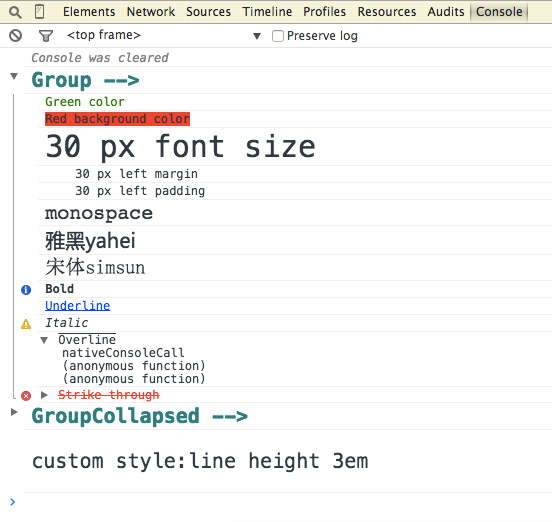

##xconsole

[![Dev Dependency status][david-dm-dev-image]][david-dm-dev-url] [![Built with Grunt][grunt-image]][grunt-url] [![Bower version][bower-image]][bower-url]

Experimental(X-) enhanced `console` for rich text display on modern browsers.

Null effects on the obsolete browsers.

Inspired by [colors](https://www.npmjs.com/package/colors).

##usage

Log message with "format specifiers":

    
    xconsole.log("30px font size".fontSize30)
    xconsole.log("red foreground".red)
    xconsole.log("blue background".bgBlue)
    xconsole.log("underline".underline)
    xconsole.log("margin 30px".margin30)

You can also chain mutiple styles:

    
    xconsole.log("chain styles".fontSize30.red.bgGreen.bold.margin20.padding10)

Style defined later will overhide the same defined earily:

    
    xconsole.log("yellow foreground but not red".red.yellow)

Note that only the strings in the front of the arguments support the format specifiers:

    
    console.log({}, "this will not work".red)
    console.log("this will work".blue, {}, "this will not work".red)

And only `log`,`debug`,`info`,`error`,`trace`,`warn` support the format specifiers,other functions like `assert`,`clear`,`count`,etc. will work as same as in the native `console` object:

    
    xconsole.count()
    xconsole.assert(true)

##api

######colors&bg
aqua,black,blue,fuchsia,gray,green,lime,maroon,navy,olive,orange,purple,red,silver,teal,white,yellow

e.g.
    
    //The followings have the same result
    "black text".black
    "black text".colorBlack

######font style
bold,italic,oblique,underline,overline,strikethrough

e.g.
    
    "bold text".bold

######font size
12~30,40,40...100px

e.g.
    
    "30px text".fontSize30

######margin&padding
margin,margin-right,margin-left,margin-top,margin-bottom,padding,padding-right,padding-left,padding-top,padding-bottom

0,5,15...100px

e.g.
    
    "margin left 10px".marginLeft10
    "padding 20px".padding20

######none
No specified style.That may lead to red foreground in `error()`.

e.g.
    
    //The followings have the same result
    "no specified style"
    "no specified style".none

##author
 - <yanni4night@gmail.com>

[david-dm-dev-url]:https://david-dm.org/yanni4night/xconsole#info=devDependencies
[david-dm-dev-image]:https://david-dm.org/yanni4night/xconsole/dev-status.svg
[grunt-url]:http://gruntjs.com/
[grunt-image]: https://cdn.gruntjs.com/builtwith.png
[bower-url]:http://badge.fury.io/bo/xconsole
[bower-image]: https://badge.fury.io/bo/xconsole.svg